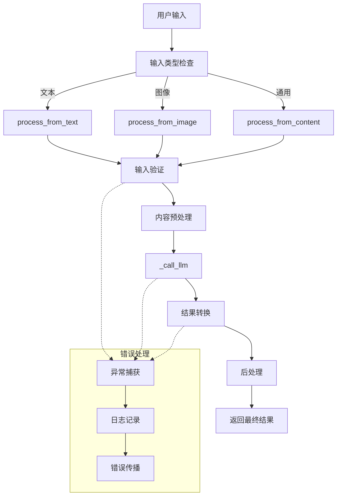
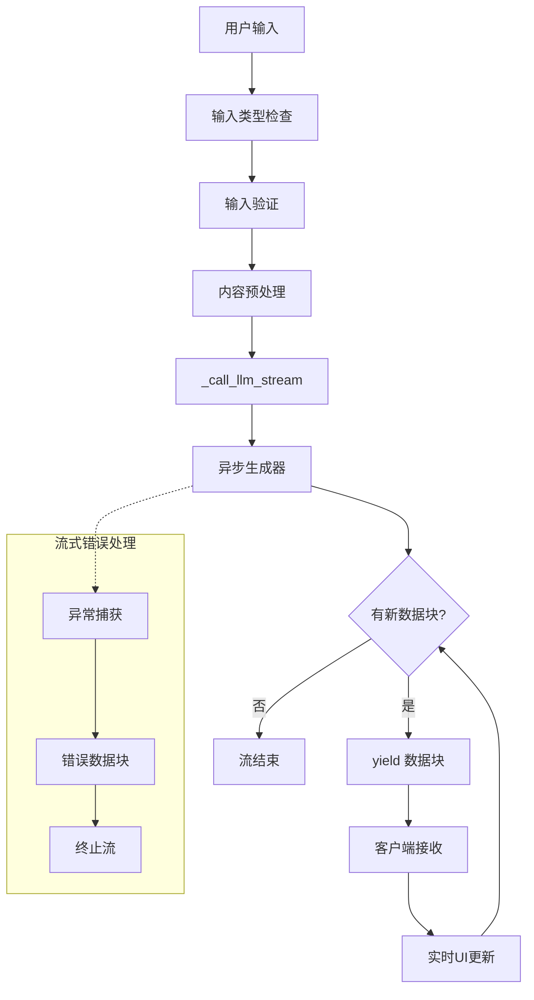

# 统一抽象基类模块 (streaming_output)

## 模块概述

该模块为 MemoFluxServer 项目提供了统一的抽象基类 `LLMContentProcessor`，用于标准化各个模块（Knowledge、Information、Schedule 等）的 LLM 内容处理接口。通过这个统一的抽象层，所有模块都能以一致的方式处理文本和图像输入，支持流式和非流式两种处理模式。

## 公开接口

### 核心抽象类

#### `LLMContentProcessor[T, T_Stream]`
统一的 LLM 内容处理器抽象基类，采用泛型设计支持不同的返回类型。

**类型参数:**
- `T`: 最终返回的 Schema 类型（如 `Document`, `Knowledge`, `Schedule`）
- `T_Stream`: 流式处理时的数据块类型（如 `PartialStreamingDocument`）

**公开方法:**

##### 非流式处理接口
- `async process_from_text(text: str, **kwargs) -> T`  
  从文本生成结构化结果
  
- `async process_from_image(image: Image, **kwargs) -> T`  
  从图像生成结构化结果
  
- `async process_from_content(content: Union[str, Image], **kwargs) -> T`  
  通用内容处理接口，自动识别输入类型

##### 流式处理接口
- `async process_from_text_stream(text: str, **kwargs) -> AsyncGenerator[T_Stream, None]`  
  流式从文本生成结果
  
- `async process_from_image_stream(image: Image, **kwargs) -> AsyncGenerator[T_Stream, None]`  
  流式从图像生成结果
  
- `async process_from_content_stream(content: Union[str, Image], **kwargs) -> AsyncGenerator[T_Stream, None]`  
  通用流式内容处理接口

### 示例实现

#### `DocumentProcessor`
文档处理器的示例实现，演示如何继承 `LLMContentProcessor` 来实现具体的业务逻辑。

**特性:**
- 支持多种文档类型识别（会议纪要、技术报告、计划文档等）
- 自动章节划分和摘要生成
- 智能标签分类
- 输入验证和内容预处理
- 结果后处理和优化

**全局实例:**
- `document_processor`: 可直接使用的文档处理器实例

## 业务逻辑

### 模块定位
该模块在整个项目中起到**接口标准化**和**代码复用**的作用：

1. **统一接口标准**: 为所有 LLM 处理模块提供一致的 API 设计
2. **减少重复代码**: 将通用逻辑（错误处理、日志记录、输入验证）统一管理
3. **提升可维护性**: 新增模块只需实现核心抽象方法，无需重复编写通用逻辑
4. **保证类型安全**: 通过泛型设计确保各模块返回类型的准确性

### 内部业务逻辑

#### 处理流程
```
用户输入 → 输入验证 → 内容预处理 → LLM调用 → 结果转换 → 后处理 → 返回结果
```

#### 错误处理机制
- 统一的异常捕获和日志记录
- 输入验证失败时的标准错误响应
- LLM 调用失败时的错误传播
- 流式处理中的错误恢复机制

#### 扩展点设计
- **抽象方法**: 子类必须实现的核心逻辑
- **钩子方法**: 子类可选择重写的扩展点
- **配置化**: 支持日志级别、超时时间等配置

## 数据流

### 非流式数据流


### 流式数据流


## 用法示例

### 基本使用

```python
from src.common.streaming_output.document_example import document_processor

# 非流式处理
async def process_document():
    result = await document_processor.process_from_text(
        "这是一份会议纪要，讨论了项目进展和下一步计划。",
        language="zh"
    )
    print(f"文档标题: {result.title}")
    print(f"文档类别: {result.category}")
    print(f"章节数量: {len(result.sections)}")

# 流式处理
async def stream_process_document():
    async for chunk in document_processor.process_from_text_stream(
        "这是一份技术报告，分析了系统性能优化方案。"
    ):
        if chunk.title and chunk.title.state == "Complete":
            print(f"标题完成: {chunk.title.value}")
        if chunk.summary and chunk.summary.state == "Complete":
            print(f"摘要完成: {chunk.summary.value}")
```

### 自定义实现

```python
from src.common.streaming_output.base import LLMContentProcessor
from src.common.streaming_output.schemas import Document, PartialStreamingDocument

class CustomProcessor(LLMContentProcessor[Document, PartialStreamingDocument]):
    
    async def _call_llm(self, content, **kwargs):
        # 实现具体的 LLM 调用逻辑
        from src.baml_client.async_client import b
        return await b.CustomFunction(content, **kwargs)
    
    async def _call_llm_stream(self, content, **kwargs):
        # 实现流式 LLM 调用逻辑
        from src.baml_client.async_client import b
        stream = b.stream.CustomFunctionStream(content, **kwargs)
        async for partial in stream:
            yield partial
    
    def _convert_to_schema(self, baml_result, original_content, **kwargs):
        # 实现结果转换逻辑
        return Document(
            title=baml_result.title,
            summary=baml_result.summary,
            # ... 其他字段
        )

# 使用自定义处理器
custom_processor = CustomProcessor()
result = await custom_processor.process_from_text("自定义处理内容")
```

### 统一接口使用

```python
# 可以处理不同类型的输入
contents = [
    "这是文本内容",
    Image.from_url("https://example.com/image.png")
]

for content in contents:
    # 统一接口自动识别输入类型
    result = await document_processor.process_from_content(content)
    print(f"处理结果: {result.title}")
```

## 设计模式

### 模板方法模式
抽象基类定义了处理流程的骨架，子类实现具体的步骤：
- `_call_llm()`: 具体的 LLM 调用实现
- `_call_llm_stream()`: 具体的流式调用实现  
- `_convert_to_schema()`: 具体的结果转换实现

### 策略模式
通过可重写的钩子方法支持不同的处理策略：
- `_validate_input()`: 不同的输入验证策略
- `_preprocess_content()`: 不同的预处理策略
- `_postprocess_result()`: 不同的后处理策略

### 泛型设计
使用 Python 的 Generic 和 TypeVar 确保类型安全：
```python
T = TypeVar('T')  # 最终结果类型
T_Stream = TypeVar('T_Stream')  # 流式数据块类型

class LLMContentProcessor(Generic[T, T_Stream], ABC):
    # 类型安全的接口定义
```

## 测试覆盖

### 单元测试
- `test_base.py`: 测试抽象基类的通用逻辑
- `test_document_example.py`: 测试示例实现的具体逻辑

### 集成测试  
- `test_integration.py`: 测试模块间协作和完整工作流程

### 测试类型
- **功能测试**: 验证各接口的基本功能
- **边界测试**: 测试输入验证和错误处理
- **性能测试**: 验证并发处理和响应时间
- **一致性测试**: 确保流式和非流式结果一致

### 运行测试
```bash
# 运行所有测试
cd /path/to/MemoFluxServer
python -m pytest src/common/streaming_output/tests/ -v

# 运行特定测试文件
python -m pytest src/common/streaming_output/tests/test_base.py -v

# 运行集成测试
python -m pytest src/common/streaming_output/tests/test_integration.py -v
```

## 使用示例脚本

运行示例脚本来查看模块的完整功能演示：

```bash
# 方式1: 作为模块运行
python -m src.common.streaming_output.example_usage

# 方式2: 直接运行脚本
cd /path/to/MemoFluxServer
python src/common/streaming_output/example_usage.py
```

示例脚本包含以下演示：
- 非流式处理演示
- 流式处理演示  
- 统一接口演示
- 错误处理演示
- 性能测试演示

## 扩展指南

### 为现有模块添加统一接口

1. **继承抽象基类**:
```python
from src.common.streaming_output.base import LLMContentProcessor

class ScheduleProcessor(LLMContentProcessor[Schedule, PartialStreamingSchedule]):
    pass
```

2. **实现抽象方法**:
```python
async def _call_llm(self, content, **kwargs):
    from src.baml_client.async_client import b
    return await b.ScheduleManager(content)

async def _call_llm_stream(self, content, **kwargs):
    from src.baml_client.async_client import b
    stream = b.stream.ScheduleManagerStream(content)
    async for partial in stream:
        yield partial

def _convert_to_schema(self, baml_result, original_content, **kwargs):
    return Schedule(
        title=baml_result.title,
        # ... 转换逻辑
    )
```

3. **可选的钩子重写**:
```python
def _validate_input(self, content, **kwargs):
    # 自定义验证逻辑
    return super()._validate_input(content, **kwargs)
```

### 添加新的处理器类型

1. 定义数据模型（在 `schemas.py` 或单独文件中）
2. 继承 `LLMContentProcessor` 并指定泛型类型
3. 实现三个抽象方法
4. 添加相应的测试文件
5. 更新文档和示例

## 注意事项

1. **类型安全**: 确保泛型参数 `T` 和 `T_Stream` 的类型匹配
2. **错误处理**: 不要在抽象方法实现中忽略异常处理
3. **日志记录**: 利用内置的日志器进行调试和监控
4. **资源管理**: 注意异步生成器的正确使用和资源释放
5. **性能考虑**: 大量并发请求时考虑连接池和限流