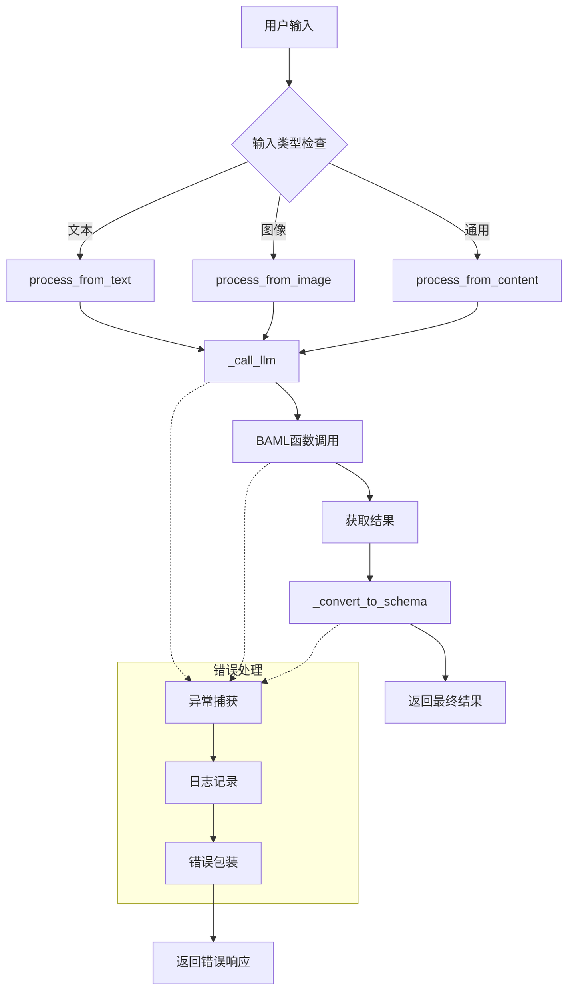
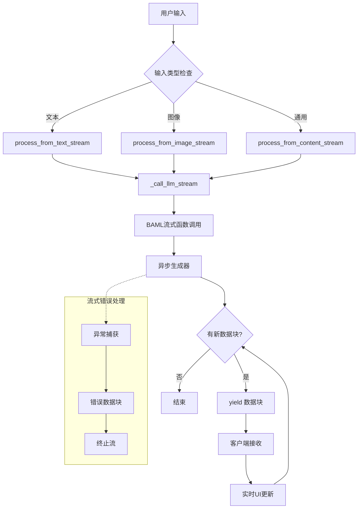
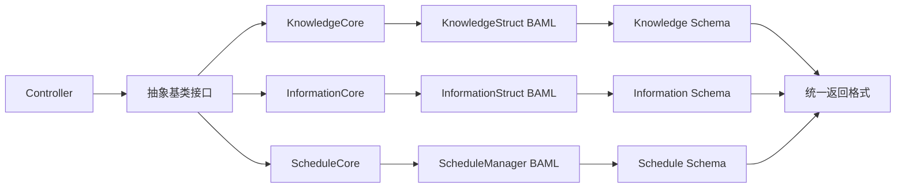

# 统一抽象基类设计计划

## 项目概述

为 MemoFluxServer 的三个核心模块（Knowledge、Information、Schedule）设计统一的抽象基类，提供一致的API接口，支持流式和非流式响应，提升代码可维护性和开发效率。

## 业务逻辑

### 1. 业务目标

- **统一接口**：三个模块使用相同的方法命名和参数模式
- **代码复用**：通用逻辑（错误处理、日志、类型检查）只需维护一次
- **扩展性**：新增模块只需实现核心抽象方法
- **类型安全**：通过泛型保持各模块的返回类型安全
- **流式支持**：统一的流式响应接口，提升用户体验

### 2. 业务价值

- **开发效率**：减少重复代码，统一开发模式
- **维护成本**：集中管理通用逻辑，降低维护复杂度
- **用户体验**：提供一致的API使用体验
- **质量保证**：统一的错误处理和测试框架

### 3. 核心功能

#### 3.1 非流式处理
- `process_from_text(text, **kwargs)` - 文本输入处理
- `process_from_image(image, **kwargs)` - 图像输入处理  
- `process_from_content(content, **kwargs)` - 通用内容处理

#### 3.2 流式处理
- `process_from_text_stream(text, **kwargs)` - 文本流式处理
- `process_from_image_stream(image, **kwargs)` - 图像流式处理
- `process_from_content_stream(content, **kwargs)` - 通用流式处理

#### 3.3 抽象方法
- `_call_llm()` - LLM调用接口
- `_call_llm_stream()` - LLM流式调用接口
- `_convert_to_schema()` - 结果转换接口

## 数据流

### 非流式数据流



### 流式数据流



### 模块间协作流



## 数据模型

### 1. 抽象基类定义

```python
from abc import ABC, abstractmethod
from typing import TypeVar, Generic, Union, List, AsyncGenerator, Any, Optional
from baml_py import Image
import logging
from datetime import datetime

T = TypeVar('T')  # 最终 Schema 类型
T_Stream = TypeVar('T_Stream')  # 流式数据块类型

class LLMContentProcessor(Generic[T, T_Stream], ABC):
    """LLM 内容处理器的抽象基类"""
    
    def __init__(self, logger_name: Optional[str] = None):
        self.logger = logging.getLogger(logger_name or self.__class__.__name__)
    
    # 公开接口 - 非流式
    async def process_from_text(self, text: str, **kwargs) -> T:
        """从文本生成结果"""
        try:
            self.logger.info(f"处理文本输入，长度: {len(text)}")
            result = await self._call_llm(text, **kwargs)
            converted = self._convert_to_schema(result, text, **kwargs)
            self.logger.info("文本处理完成")
            return converted
        except Exception as e:
            self.logger.error(f"文本处理失败: {e}")
            raise
    
    async def process_from_image(self, image: Image, **kwargs) -> T:
        """从图像生成结果"""
        try:
            self.logger.info("处理图像输入")
            result = await self._call_llm(image, **kwargs)
            converted = self._convert_to_schema(result, "image_content", **kwargs)
            self.logger.info("图像处理完成")
            return converted
        except Exception as e:
            self.logger.error(f"图像处理失败: {e}")
            raise
    
    async def process_from_content(self, content: Union[str, Image], **kwargs) -> T:
        """通用内容处理接口"""
        if isinstance(content, str):
            return await self.process_from_text(content, **kwargs)
        else:
            return await self.process_from_image(content, **kwargs)
    
    # 公开接口 - 流式
    async def process_from_text_stream(self, text: str, **kwargs) -> AsyncGenerator[T_Stream, None]:
        """流式从文本生成结果"""
        try:
            self.logger.info(f"开始流式处理文本，长度: {len(text)}")
            async for chunk in self._call_llm_stream(text, **kwargs):
                yield chunk
            self.logger.info("流式文本处理完成")
        except Exception as e:
            self.logger.error(f"流式文本处理失败: {e}")
            raise
    
    async def process_from_image_stream(self, image: Image, **kwargs) -> AsyncGenerator[T_Stream, None]:
        """流式从图像生成结果"""
        try:
            self.logger.info("开始流式处理图像")
            async for chunk in self._call_llm_stream(image, **kwargs):
                yield chunk
            self.logger.info("流式图像处理完成")
        except Exception as e:
            self.logger.error(f"流式图像处理失败: {e}")
            raise
    
    async def process_from_content_stream(self, content: Union[str, Image], **kwargs) -> AsyncGenerator[T_Stream, None]:
        """通用流式内容处理接口"""
        if isinstance(content, str):
            async for chunk in self.process_from_text_stream(content, **kwargs):
                yield chunk
        else:
            async for chunk in self.process_from_image_stream(content, **kwargs):
                yield chunk
    
    # 抽象方法 - 子类必须实现
    @abstractmethod
    async def _call_llm(self, content: Union[str, Image], **kwargs) -> Any:
        """调用对应的 BAML 函数"""
        pass
    
    @abstractmethod
    async def _call_llm_stream(self, content: Union[str, Image], **kwargs) -> AsyncGenerator[T_Stream, None]:
        """调用对应的 BAML 流式函数"""
        pass
    
    @abstractmethod
    def _convert_to_schema(self, baml_result: Any, original_content: str, **kwargs) -> T:
        """将 BAML 结果转换为本地 Schema"""
        pass
    
    # 可选的钩子方法
    def _validate_input(self, content: Union[str, Image], **kwargs) -> bool:
        """输入验证钩子，子类可重写"""
        return True
    
    def _preprocess_content(self, content: Union[str, Image], **kwargs) -> Union[str, Image]:
        """内容预处理钩子，子类可重写"""
        return content
    
    def _postprocess_result(self, result: T, **kwargs) -> T:
        """结果后处理钩子，子类可重写"""
        return result
```

### 2. 具体实现示例

```python
from src.baml_client.types import (
    PartialStreamingKnowledge, 
    PartialStreamingInformation, 
    PartialStreamingSchedule
)

# Knowledge 模块实现
class KnowledgeCore(LLMContentProcessor[Knowledge, PartialStreamingKnowledge]):
    
    async def _call_llm(self, content: Union[str, Image], **kwargs) -> Any:
        tags = kwargs.get('tags', [])
        from src.baml_client.async_client import b
        return await b.KnowledgeStruct(content, tags)
    
    async def _call_llm_stream(self, content: Union[str, Image], **kwargs) -> AsyncGenerator[PartialStreamingKnowledge, None]:
        tags = kwargs.get('tags', [])
        from src.baml_client.async_client import b
        stream = b.stream.KnowledgeStructStream(content, tags)
        async for partial in stream:
            yield partial
    
    def _convert_to_schema(self, baml_result: Any, original_content: str, **kwargs) -> Knowledge:
        from src.knowledge.schemas import Knowledge
        # 转换逻辑...
        return Knowledge(...)

# Information 模块实现
class InformationCore(LLMContentProcessor[Information, PartialStreamingInformation]):
    
    async def _call_llm(self, content: Union[str, Image], **kwargs) -> Any:
        tags = kwargs.get('tags', [])
        from src.baml_client.async_client import b
        return await b.InformationStruct(content, tags)
    
    async def _call_llm_stream(self, content: Union[str, Image], **kwargs) -> AsyncGenerator[PartialStreamingInformation, None]:
        tags = kwargs.get('tags', [])
        from src.baml_client.async_client import b
        stream = b.stream.InformationStructStream(content, tags)
        async for partial in stream:
            yield partial
    
    def _convert_to_schema(self, baml_result: Any, original_content: str, **kwargs) -> Information:
        from src.information.schemas import Information
        # 转换逻辑...
        return Information(...)

# Schedule 模块实现
class ScheduleCore(LLMContentProcessor[Schedule, PartialStreamingSchedule]):
    
    async def _call_llm(self, content: Union[str, Image], **kwargs) -> Any:
        from src.baml_client.async_client import b
        return await b.ScheduleManager(content)
    
    async def _call_llm_stream(self, content: Union[str, Image], **kwargs) -> AsyncGenerator[PartialStreamingSchedule, None]:
        from src.baml_client.async_client import b
        stream = b.stream.ScheduleManagerStream(content)
        async for partial in stream:
            yield partial
    
    def _convert_to_schema(self, baml_result: Any, original_content: str, **kwargs) -> Schedule:
        from src.schedules.schemas import Schedule
        # 转换逻辑...
        return Schedule(...)
```

### 3. 具体类型示例 (以 Schedule 模块为例)

为了让你更直观地理解 `T` 和 `T_Stream` 的区别，这里是 `Schedule` 模块中对应的具体代码。

#### **`T` - 最终 Schema 类型 (`Schedule`)**

这是我们应用中最终使用的、完整的、经过验证的数据结构。它通常定义在模块的 `schemas.py` 文件中。

```python
# src/schedules/schemas.py

import uuid
from pydantic import BaseModel, Field
from typing import List, Optional

class Task(BaseModel):
    """单个任务的数据模型"""
    id: str = Field(default_factory=lambda: str(uuid.uuid4()))
    start_time: Optional[str] = None
    end_time: Optional[str] = None
    people: List[str] = []
    theme: Optional[str] = None
    core_tasks: List[str] = []
    position: List[str] = []
    tags: List[str] = []
    category: Optional[str] = None
    suggested_actions: List[str] = []

class Schedule(BaseModel):
    """
    最终的日程安排 Schema (T)
    这是经过完整处理和验证后，应用逻辑中使用的对象。
    """
    id: str = Field(default_factory=lambda: str(uuid.uuid4()))
    title: str
    category: str
    tasks: List[Task]
    original_content: str
```

#### **`T_Stream` - 流式数据块类型 (`PartialStreamingSchedule`)**

这是由 BAML 根据 `.baml` 文件中的 `stream` 属性自动生成的**部分类型**。它位于 `baml_client/partial_types` 目录下。它的字段都是可选的，并且某些字段被 `StreamState` 包裹，用来追踪流式生成的状态。

```python
# baml_client/partial_types/_partial_streaming_schedule.py (由 BAML 自动生成)

from pydantic import BaseModel
from typing import List, Literal, Generic, TypeVar, Optional

T_co = TypeVar('T_co', covariant=True)

class StreamState(BaseModel, Generic[T_co]):
    """
    包裹流式字段的状态机，由 BAML 自动生成。
    """
    value: T_co
    state: Literal["Pending", "Incomplete", "Complete", "Error"]

class PartialTask(BaseModel):
    """自动生成的任务部分类型"""
    start_time: Optional[str] = None
    end_time: Optional[str] = None
    people: Optional[List[Optional[str]]] = None
    theme: Optional[str] = None
    core_tasks: Optional[List[Optional[str]]] = None
    position: Optional[List[Optional[str]]] = None
    tags: Optional[List[Optional[str]]] = None
    category: Optional[str] = None
    suggested_actions: Optional[List[Optional[str]]] = None

class PartialStreamingSchedule(BaseModel):
    """
    流式日程安排的部分类型 (T_Stream)
    这是在流式处理过程中，每个数据块的实际类型。
    """
    title: Optional[StreamState[Optional[str]]] = None
    category: Optional[str] = None  # 使用 @stream.done，所以没有 StreamState
    tasks: Optional[StreamState[Optional[List[Optional[PartialTask]]]]] = None
```

通过这两个示例，你可以清晰地看到：

-   `T` (`Schedule`) 是一个结构严谨、字段完整的最终对象。
-   `T_Stream` (`PartialStreamingSchedule`) 是一个字段可选、包含流式状态的中间对象，专门用于流式传输。

### 3. 配置模型

```python
from pydantic import BaseModel
from typing import Dict, Any, Optional

class ProcessorConfig(BaseModel):
    """处理器配置"""
    enable_logging: bool = True
    log_level: str = "INFO"
    timeout_seconds: int = 30
    retry_count: int = 3
    enable_caching: bool = False
    cache_ttl_seconds: int = 3600

class StreamConfig(BaseModel):
    """流式处理配置"""
    buffer_size: int = 1024
    chunk_timeout_seconds: float = 5.0
    enable_compression: bool = False
    
class ModuleRegistry(BaseModel):
    """模块注册表"""
    processors: Dict[str, Any] = {}
    configs: Dict[str, ProcessorConfig] = {}
    
    def register(self, name: str, processor_class: type, config: ProcessorConfig):
        """注册处理器"""
        self.processors[name] = processor_class
        self.configs[name] = config
    
    def get_processor(self, name: str, **kwargs):
        """获取处理器实例"""
        if name not in self.processors:
            raise ValueError(f"未注册的处理器: {name}")
        
        processor_class = self.processors[name]
        config = self.configs[name]
        return processor_class(config=config, **kwargs)
```

## TDD 的测试

### 1. 测试策略

#### 1.1 测试层次
- **单元测试**：测试每个抽象方法的实现
- **集成测试**：测试完整的处理流程
- **流式测试**：测试流式响应的正确性
- **性能测试**：测试响应时间和吞吐量

#### 1.2 测试覆盖
- 抽象基类的通用逻辑
- 各具体实现的特定逻辑
- 错误处理和边界情况
- 流式数据的完整性

### 2. 测试实现

#### 2.1 抽象基类测试

```python
# tests/test_llm_content_processor.py
import pytest
from unittest.mock import AsyncMock, patch
from abc import ABC
from typing import Any, AsyncGenerator
from baml_py import Image

from streaming_output.base import LLMContentProcessor

class MockResult:
    def __init__(self, data):
        self.data = data

class MockProcessor(LLMContentProcessor[dict, dict]):
    """测试用的模拟处理器"""
    
    async def _call_llm(self, content, **kwargs):
        return MockResult({"processed": True, "content_type": type(content).__name__})
    
    async def _call_llm_stream(self, content, **kwargs):
        for i in range(3):
            yield MockResult({"chunk": i, "content_type": type(content).__name__})
    
    def _convert_to_schema(self, baml_result, original_content: str, **kwargs):
        return {
            "result": baml_result.data,
            "original": original_content,
            "kwargs": kwargs
        }

class TestLLMContentProcessor:
    
    @pytest.fixture
    def processor(self):
        return MockProcessor()
    
    @pytest.mark.asyncio
    async def test_process_from_text(self, processor):
        """测试文本处理"""
        result = await processor.process_from_text("test text", extra_param="test")
        
        assert result["result"]["processed"] is True
        assert result["result"]["content_type"] == "str"
        assert result["original"] == "test text"
        assert result["kwargs"]["extra_param"] == "test"
    
    @pytest.mark.asyncio
    async def test_process_from_image(self, processor):
        """测试图像处理"""
        mock_image = Image.from_url("https://example.com/test.png")
        result = await processor.process_from_image(mock_image)
        
        assert result["result"]["processed"] is True
        assert result["result"]["content_type"] == "Image"
        assert result["original"] == "image_content"
    
    @pytest.mark.asyncio
    async def test_process_from_content_with_text(self, processor):
        """测试通用接口处理文本"""
        result = await processor.process_from_content("test content")
        assert result["result"]["content_type"] == "str"
    
    @pytest.mark.asyncio
    async def test_process_from_content_with_image(self, processor):
        """测试通用接口处理图像"""
        mock_image = Image.from_url("https://example.com/test.png")
        result = await processor.process_from_content(mock_image)
        assert result["result"]["content_type"] == "Image"
    
    @pytest.mark.asyncio
    async def test_process_from_text_stream(self, processor):
        """测试文本流式处理"""
        chunks = []
        async for chunk in processor.process_from_text_stream("test stream"):
            chunks.append(chunk)
        
        assert len(chunks) == 3
        for i, chunk in enumerate(chunks):
            assert chunk.data["chunk"] == i
            assert chunk.data["content_type"] == "str"
    
    @pytest.mark.asyncio
    async def test_process_from_image_stream(self, processor):
        """测试图像流式处理"""
        mock_image = Image.from_url("https://example.com/test.png")
        chunks = []
        async for chunk in processor.process_from_image_stream(mock_image):
            chunks.append(chunk)
        
        assert len(chunks) == 3
        for chunk in chunks:
            assert chunk.data["content_type"] == "Image"
    
    @pytest.mark.asyncio
    async def test_process_from_content_stream_with_text(self, processor):
        """测试通用流式接口处理文本"""
        chunks = []
        async for chunk in processor.process_from_content_stream("test stream"):
            chunks.append(chunk)
        
        assert len(chunks) == 3
        assert all(chunk.data["content_type"] == "str" for chunk in chunks)
    
    @pytest.mark.asyncio
    async def test_process_from_content_stream_with_image(self, processor):
        """测试通用流式接口处理图像"""
        mock_image = Image.from_url("https://example.com/test.png")
        chunks = []
        async for chunk in processor.process_from_content_stream(mock_image):
            chunks.append(chunk)
        
        assert len(chunks) == 3
        assert all(chunk.data["content_type"] == "Image" for chunk in chunks)
    
    @pytest.mark.asyncio
    async def test_error_handling_in_process_text(self, processor):
        """测试文本处理错误处理"""
        # 模拟 _call_llm 抛出异常
        with patch.object(processor, '_call_llm', side_effect=Exception("LLM error")):
            with pytest.raises(Exception, match="LLM error"):
                await processor.process_from_text("test")
    
    @pytest.mark.asyncio
    async def test_error_handling_in_stream(self, processor):
        """测试流式处理错误处理"""
        async def mock_error_stream(*args, **kwargs):
            yield MockResult({"chunk": 0})
            raise Exception("Stream error")
        
        with patch.object(processor, '_call_llm_stream', side_effect=mock_error_stream):
            with pytest.raises(Exception, match="Stream error"):
                chunks = []
                async for chunk in processor.process_from_text_stream("test"):
                    chunks.append(chunk)
```

#### 2.2 具体模块测试模板

```python
# tests/test_knowledge_core.py
import pytest
from unittest.mock import AsyncMock, patch

from streaming_output.knowledge_core import KnowledgeCore
from src.knowledge.schemas import Knowledge

class TestKnowledgeCore:
    
    @pytest.fixture
    def knowledge_core(self):
        return KnowledgeCore()
    
    @pytest.mark.asyncio
    async def test_call_llm_with_tags(self, knowledge_core):
        """测试带标签的LLM调用"""
        mock_result = create_mock_baml_knowledge()
        
        with patch('src.baml_client.async_client.b.KnowledgeStruct', 
                  new=AsyncMock(return_value=mock_result)):
            result = await knowledge_core._call_llm("test content", tags=["tag1", "tag2"])
            assert result == mock_result
    
    @pytest.mark.asyncio
    async def test_call_llm_stream(self, knowledge_core):
        """测试流式LLM调用"""
        mock_chunks = [create_mock_streaming_knowledge(i) for i in range(3)]
        
        async def mock_stream(*args, **kwargs):
            for chunk in mock_chunks:
                yield chunk
        
        with patch('src.baml_client.async_client.b.stream.KnowledgeStructStream', 
                  return_value=mock_stream()):
            chunks = []
            async for chunk in knowledge_core._call_llm_stream("test", tags=["tag1"]):
                chunks.append(chunk)
            
            assert len(chunks) == 3
    
    def test_convert_to_schema(self, knowledge_core):
        """测试结果转换"""
        mock_baml_result = create_mock_baml_knowledge()
        result = knowledge_core._convert_to_schema(
            mock_baml_result, 
            "original content", 
            tags=["tag1"]
        )
        
        assert isinstance(result, Knowledge)
        assert result.title == mock_baml_result.title
    
    @pytest.mark.asyncio
    async def test_full_process_flow(self, knowledge_core):
        """测试完整处理流程"""
        mock_baml_result = create_mock_baml_knowledge()
        
        with patch('src.baml_client.async_client.b.KnowledgeStruct', 
                  new=AsyncMock(return_value=mock_baml_result)):
            result = await knowledge_core.process_from_text(
                "test knowledge content", 
                tags=["science", "physics"]
            )
            
            assert isinstance(result, Knowledge)
            assert result.title == "Test Knowledge"

def create_mock_baml_knowledge():
    """创建模拟的BAML知识结果"""
    # 返回模拟对象...

def create_mock_streaming_knowledge(chunk_id):
    """创建模拟的流式知识块"""
    # 返回模拟对象...
```

#### 2.3 集成测试

```python
# tests/integration/test_unified_interface.py
import pytest
from unittest.mock import patch, AsyncMock

from streaming_output.knowledge_core import KnowledgeCore
from streaming_output.information_core import InformationCore
from streaming_output.schedule_core import ScheduleCore

class TestUnifiedInterface:
    """测试统一接口的集成功能"""
    
    @pytest.fixture
    def all_processors(self):
        return {
            'knowledge': KnowledgeCore(),
            'information': InformationCore(),
            'schedule': ScheduleCore()
        }
    
    @pytest.mark.asyncio
    async def test_unified_text_processing(self, all_processors):
        """测试所有处理器的文本处理统一性"""
        test_content = "今天天气很好，我要去公园学习新知识，下午2点有个会议。"
        
        # 模拟各模块的BAML调用
        with patch_all_baml_calls():
            results = {}
            for name, processor in all_processors.items():
                if name in ['knowledge', 'information']:
                    result = await processor.process_from_text(test_content, tags=["test"])
                else:  # schedule
                    result = await processor.process_from_text(test_content)
                results[name] = result
        
        # 验证所有处理器都返回了结果
        assert len(results) == 3
        for name, result in results.items():
            assert result is not None
            assert hasattr(result, 'id')
    
    @pytest.mark.asyncio
    async def test_unified_streaming_processing(self, all_processors):
        """测试所有处理器的流式处理统一性"""
        test_content = "流式处理测试内容"
        
        with patch_all_baml_streaming_calls():
            for name, processor in all_processors.items():
                chunks = []
                if name in ['knowledge', 'information']:
                    async for chunk in processor.process_from_text_stream(test_content, tags=["test"]):
                        chunks.append(chunk)
                else:  # schedule
                    async for chunk in processor.process_from_text_stream(test_content):
                        chunks.append(chunk)
                
                # 验证流式处理返回了数据块
                assert len(chunks) > 0
                
    @pytest.mark.asyncio
    async def test_error_consistency(self, all_processors):
        """测试错误处理的一致性"""
        # 模拟LLM调用失败
        with patch_all_baml_calls_with_error():
            for name, processor in all_processors.items():
                with pytest.raises(Exception):
                    if name in ['knowledge', 'information']:
                        await processor.process_from_text("error test", tags=["test"])
                    else:
                        await processor.process_from_text("error test")

def patch_all_baml_calls():
    """模拟所有BAML调用成功"""
    # 返回复合的patch上下文管理器

def patch_all_baml_streaming_calls():
    """模拟所有BAML流式调用成功"""
    # 返回复合的patch上下文管理器

def patch_all_baml_calls_with_error():
    """模拟所有BAML调用失败"""
    # 返回复合的patch上下文管理器
```

#### 2.4 性能测试

```python
# tests/performance/test_performance.py
import pytest
import asyncio
import time
from concurrent.futures import ThreadPoolExecutor

from streaming_output.base import LLMContentProcessor

class TestPerformance:
    
    @pytest.mark.asyncio
    @pytest.mark.performance
    async def test_concurrent_processing(self, all_processors):
        """测试并发处理性能"""
        test_contents = [f"测试内容 {i}" for i in range(10)]
        
        start_time = time.time()
        
        # 并发处理
        tasks = []
        for processor in all_processors.values():
            for content in test_contents:
                if hasattr(processor, '_requires_tags'):
                    task = processor.process_from_text(content, tags=["test"])
                else:
                    task = processor.process_from_text(content)
                tasks.append(task)
        
        results = await asyncio.gather(*tasks)
        end_time = time.time()
        
        # 验证性能指标
        processing_time = end_time - start_time
        assert processing_time < 30  # 应在30秒内完成
        assert len(results) == len(all_processors) * len(test_contents)
    
    @pytest.mark.asyncio
    @pytest.mark.performance
    async def test_streaming_latency(self, schedule_core):
        """测试流式处理延迟"""
        start_time = time.time()
        first_chunk_time = None
        chunk_count = 0
        
        async for chunk in schedule_core.process_from_text_stream("延迟测试内容"):
            if first_chunk_time is None:
                first_chunk_time = time.time()
            chunk_count += 1
        
        end_time = time.time()
        
        # 验证延迟指标
        if first_chunk_time:
            time_to_first_chunk = first_chunk_time - start_time
            assert time_to_first_chunk < 5  # 首个数据块应在5秒内到达
        
        total_time = end_time - start_time
        assert total_time < 15  # 总处理时间应在15秒内
        assert chunk_count > 0  # 应有数据块返回
```

### 3. 测试配置

```python
# pytest.ini 添加配置
[tool:pytest]
markers =
    performance: 性能测试标记
    integration: 集成测试标记
    unit: 单元测试标记
    streaming: 流式处理测试标记

# conftest.py
import pytest
import asyncio
from unittest.mock import patch

@pytest.fixture(scope="session")
def event_loop():
    """创建事件循环"""
    loop = asyncio.get_event_loop_policy().new_event_loop()
    yield loop
    loop.close()

@pytest.fixture
def mock_baml_client():
    """模拟BAML客户端"""
    with patch('src.baml_client.async_client.b') as mock_b:
        yield mock_b

@pytest.fixture(autouse=True)
def setup_logging():
    """设置测试日志"""
    import logging
    logging.basicConfig(level=logging.DEBUG)
```

### 4. 持续集成配置

```yaml
# .github/workflows/test.yml
name: Test Suite

on: [push, pull_request]

jobs:
  test:
    runs-on: ubuntu-latest
    
    steps:
    - uses: actions/checkout@v2
    
    - name: Set up Python
      uses: actions/setup-python@v2
      with:
        python-version: '3.11'
    
    - name: Install dependencies
      run: |
        pip install -r requirements.txt
        pip install pytest pytest-asyncio pytest-cov
    
    - name: Run unit tests
      run: pytest tests/ -m "unit" --cov=streaming_output
    
    - name: Run integration tests
      run: pytest tests/ -m "integration"
    
    - name: Run performance tests
      run: pytest tests/ -m "performance" --tb=short
    
    - name: Upload coverage
      uses: codecov/codecov-action@v1
```