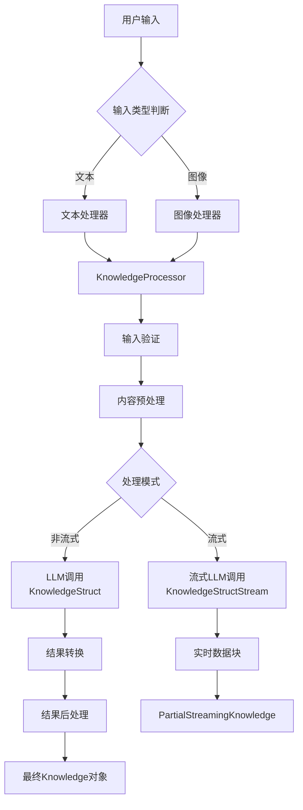

# Knowledge Streaming 模块实现计划

## 项目概述
基于现有的流式输出架构（`src/common/streaming_output`）创建 `knowledge_streaming` 模块，实现流式知识结构化功能。

## 架构设计

### 1. 目录结构
```
src/knowledge_streaming/
├── __init__.py           # 模块导出
├── schemas.py            # 数据模型定义
├── processor.py          # 主要的 KnowledgeProcessor 实现
├── tests/                # 测试文件
│   ├── __init__.py
│   ├── test_processor.py # 处理器测试
│   └── test_integration.py # 集成测试
└── README.md            # 模块文档
```

### 2. 数据流设计



### 3. 核心组件

#### 3.1 数据模型 (schemas.py)
- `Knowledge`: 最终知识对象
- `KnowledgeItem`: 知识项对象
- `PartialStreamingKnowledge`: 流式数据块类型
- `StreamState`: 流式状态包装器

#### 3.2 处理器 (processor.py)
- `KnowledgeProcessor`: 继承自 `LLMContentProcessor`
  - 实现 `_call_llm()`: 调用 BAML KnowledgeStruct
  - 实现 `_call_llm_stream()`: 调用 BAML KnowledgeStructStream
  - 实现 `_convert_to_schema()`: 转换 BAML 结果为本地 Schema

### 4. 接口设计

#### 4.1 公开接口
```python
# 非流式处理
async def process_from_text(text: str, tags: List[str]) -> Knowledge
async def process_from_image(image: Image) -> Knowledge
async def process_from_content(content: Union[str, Image], tags: List[str]) -> Knowledge

# 流式处理
async def process_from_text_stream(text: str, tags: List[str]) -> AsyncGenerator[PartialStreamingKnowledge, None]
async def process_from_image_stream(image: Image, tags: List[str]) -> AsyncGenerator[PartialStreamingKnowledge, None]
async def process_from_content_stream(content: Union[str, Image], tags: List[str]) -> AsyncGenerator[PartialStreamingKnowledge, None]
```

### 5. 实现步骤
1. 创建基础结构
2. 定义数据模型
3. 实现处理器
4. 集成BAML
5. 添加测试
6. 编写文档

### 6. 与现有模块的关系
- 基于 `src.common.streaming_output.base.LLMContentProcessor`
- 使用 `src.baml_client` 的 BAML 函数
- 替换 `src.controller_streaming.placeholders.knowledge`