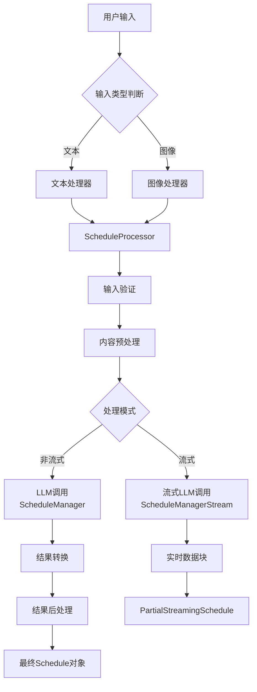

# Schedules Streaming 模块实现计划

## 项目概述
基于现有的流式输出架构（`src/common/streaming_output`）改造 schedules 模块，创建一个新的 `schedules_streaming` 目录，实现流式日程管理功能。

## 架构设计

### 1. 目录结构
```
src/schedules_streaming/
├── __init__.py           # 模块导出
├── schemas.py            # 数据模型定义
├── processor.py          # 主要的 ScheduleProcessor 实现
├── tests/                # 测试文件
│   ├── __init__.py
│   ├── test_processor.py # 处理器测试
│   └── test_integration.py # 集成测试
└── README.md            # 模块文档
```

### 2. 数据流设计



### 3. 核心组件

#### 3.1 数据模型 (schemas.py)
- `Schedule`: 最终日程对象
- `Task`: 日程任务对象
- `PartialStreamingSchedule`: 流式数据块类型
- `PartialStreamingTask`: 流式任务类型
- `StreamState`: 流式状态包装器

#### 3.2 处理器 (processor.py)
- `ScheduleProcessor`: 继承自 `LLMContentProcessor`
  - 实现 `_call_llm()`: 调用 BAML ScheduleManager
  - 实现 `_call_llm_stream()`: 调用 BAML ScheduleManagerStream
  - 实现 `_convert_to_schema()`: 转换 BAML 结果为本地 Schema
  - 可选钩子方法：输入验证、预处理、后处理

### 4. 接口设计

#### 4.1 公开接口
```python
# 非流式处理
async def process_from_text(text: str) -> Schedule
async def process_from_image(image: Image) -> Schedule
async def process_from_content(content: Union[str, Image]) -> Schedule

# 流式处理
async def process_from_text_stream(text: str) -> AsyncGenerator[PartialStreamingSchedule, None]
async def process_from_image_stream(image: Image) -> AsyncGenerator[PartialStreamingSchedule, None]
async def process_from_content_stream(content: Union[str, Image]) -> AsyncGenerator[PartialStreamingSchedule, None]
```

#### 4.2 使用示例
```python
from src.schedules_streaming import schedule_processor

# 非流式处理
schedule = await schedule_processor.process_from_text("明天上午9点开会")

# 流式处理
async for partial in schedule_processor.process_from_text_stream("明天上午9点开会"):
    print(partial.title.value)  # 实时获取标题
    print(partial.tasks.value)  # 实时获取任务列表
```

### 5. 实现步骤

1. **创建基础结构**: 建立目录和文件框架
2. **定义数据模型**: 创建 schemas.py 中的类型定义
3. **实现处理器**: 创建 processor.py 中的 ScheduleProcessor
4. **集成BAML**: 连接 BAML 的 ScheduleManager 和 ScheduleManagerStream
5. **添加测试**: 创建完整的测试套件
6. **编写文档**: 创建使用说明和API文档

### 6. 与现有模块的差异

| 特性 | 现有 schedules | schedules_streaming |
|------|---------------|-------------------|
| 架构 | 直接调用 | 基于抽象基类 |
| 流式支持 | 基础流式 | 完整流式架构 |
| 扩展性 | 有限 | 高度可扩展 |
| 错误处理 | 基础 | 完整的钩子系统 |
| 预处理 | 无 | 支持内容预处理 |
| 后处理 | 无 | 支持结果后处理 |

### 7. 技术要点

- 使用泛型抽象基类确保类型安全
- 实现完整的异步流式处理
- 提供统一的错误处理和日志记录
- 支持输入验证和内容预处理
- 与现有 BAML 函数无缝集成

### 8. 测试策略

- 单元测试：验证各个方法的正确性
- 集成测试：验证与 BAML 的集成
- 流式测试：验证流式数据的正确性
- 边界测试：处理空输入、无效输入等边界情况